

    <h1>🤖 Topup Helper Bot 🤖</h1>

<table>
  <tr>
    <th align="left">🇷🇺 RU</th>
  </tr>
  <tr>
    <td>
      Добро пожаловать в проект <b>Topup Helper Bot</b> ! Я написал этого бота для удобства пополнения разных сайтов криптой, в том числе для пользователей, которые с ней не знакомы и не имеют аккаунта на бирже или личного кошелька.
    </td>
  </tr>
  <tr>
    <th align="left">🇺🇸 EN</th>
  </tr>
  <tr>
    <td>
      Welcome to the <b>Topup Helper Bot</b> project ! I wrote this bot for the convenience of funding different websites with crypto, including the users who are not familiar with it and do not have an exchange account or their own wallet.
    </td>
  </tr>
</table>

&nbsp;

&nbsp;

    <h1>Основной функционал / Main functionality</h1>

## 📲 Регистрация / Signing up

<table>
  <tr>
    <th align="left">🇷🇺 RU</th>
  </tr>
  <tr>
    <td>
      Для доступа к функционалу бота, пользователи регистрируются по номеру телефона: отправляют свой контакт боту. Это поможет минимизировать злоупотребление ботом в нелегальных целях.
    </td>
  </tr>
  <tr>
    <th align="left">🇺🇸 EN</th>
  </tr>
  <tr>
    <td>
      To access the bot's functionality, users sign up with phone number: send their contact to the bot. This will help minimize the abuse of the bot for illegal purposes.
    </td>
  </tr>
</table>

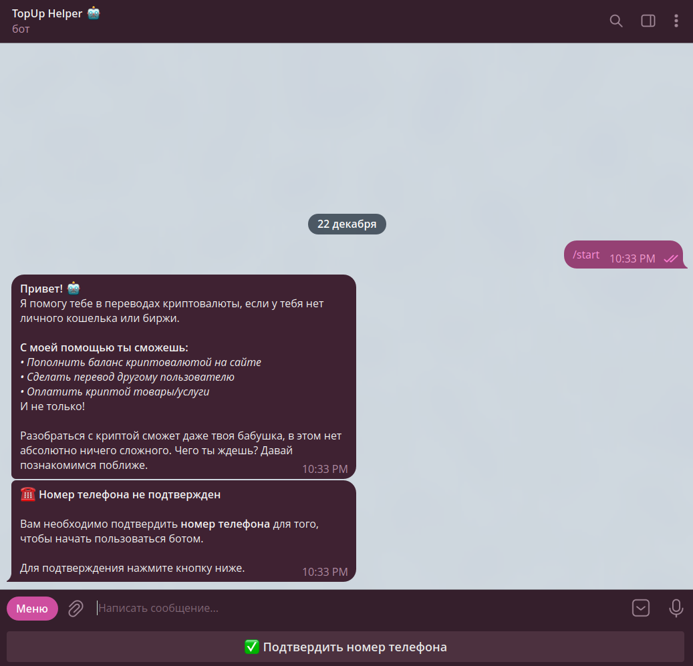
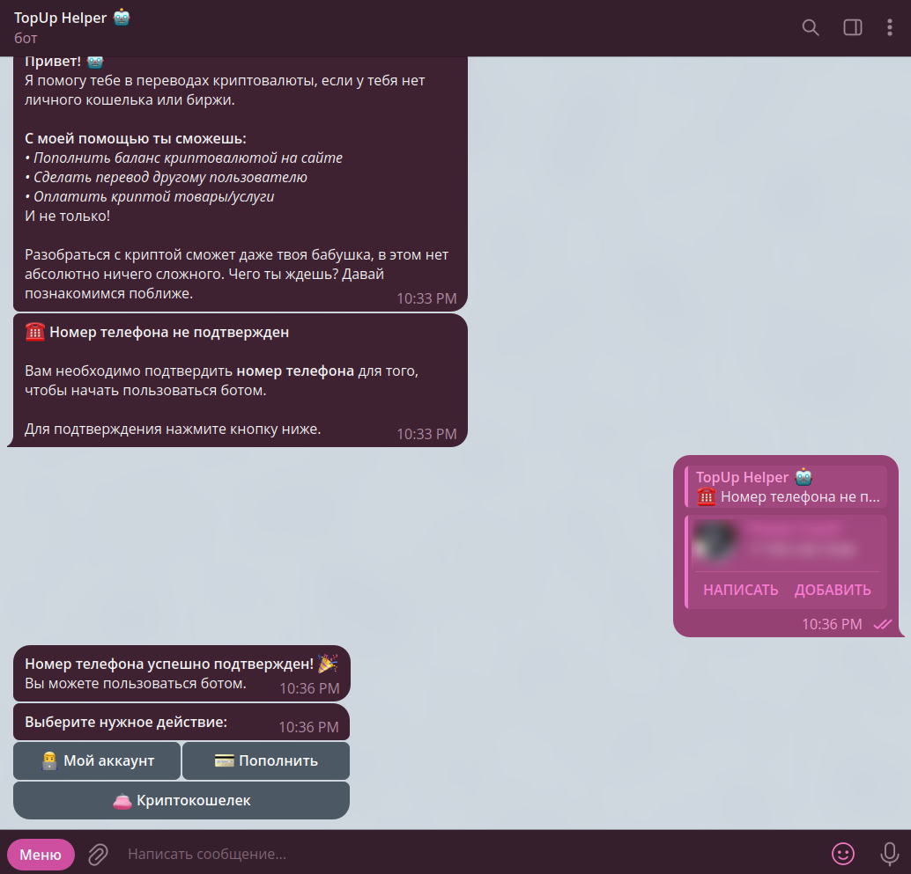

&nbsp;

## 📊 Аккаунт / Account

<table>
  <tr>
    <th align="left">🇷🇺 RU</th>
  </tr>
  <tr>
    <td>
      Каждый пользователь имеет свой аккаунт в боте, где отображаются его основные данные, такие как:
      <ul>
        <li>ID телеграм аккаунта</li>
        <li>Номер телефона (последние 4 цифры скрыты)</li>
        <li>Дата регистрации</li>
        <li>Баланс пользователя</li>
        <li>Общая сумма пополнений</li>
      </ul>
      В разделе аккаунт пользователь может посмотреть историю своих транзакций, сделать перевод своего баланса другому пользователю или обратиться в поддержку бота (подробнее об этом дальше).
    </td>
  </tr>
  <tr>
    <th align="left">🇺🇸 EN</th>
  </tr>
  <tr>
    <td>
      Every user has a personal account in the bot, where his main data is displayed, such as:
      <ul>
        <li>Telegram account ID</li>
        <li>Phone number (last 4 digits are hidden)</li>
        <li>Registration date</li>
        <li>User balance</li>
        <li>Total fundings amount</li>
      </ul>
      In the account section user is able to look through his transaction history, send funds to another user or make an appeal in bot's support (more details on this later).
    </td>
  </tr>
</table>

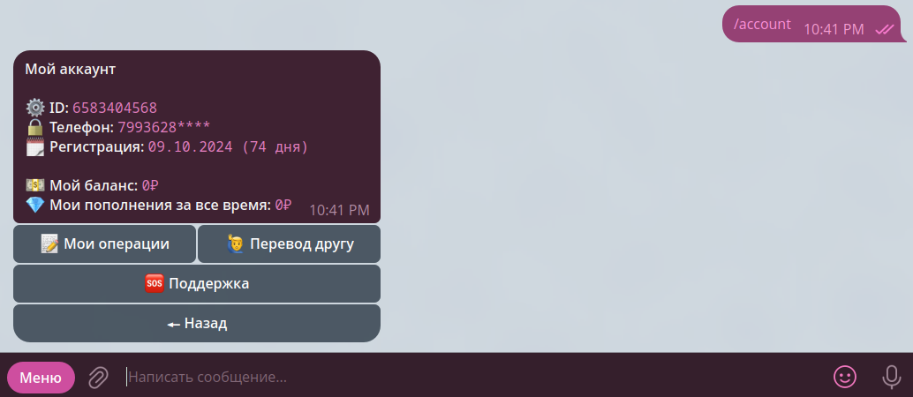

&nbsp;

## 💵 Пополнение Баланса / Balance funding

<table>
  <tr>
    <th align="left">🇷🇺 RU</th>
  </tr>
  <tr>
    <td>
      Пользователи могут пополнить свой баланс внутри бота (пока только) через <b>Telegram Stars</b>. Stars конвертируются в рубли на баланс, независимо от того, в какой валюте были куплены. Баланс нужен для пополнения криптокошелька в дальнейшем.
    </td>
  </tr>
  <tr>
    <th align="left">🇺🇸 EN</th>
  </tr>
  <tr>
    <td>
      Users can fund their balances in the bot (yet only) via <b>Telegram Stars</b>. Stars converts into rubles on the balance, regardless the currency they were purchased for. Balance is used to fund crypto wallet later.
    </td>
  </tr>
</table>

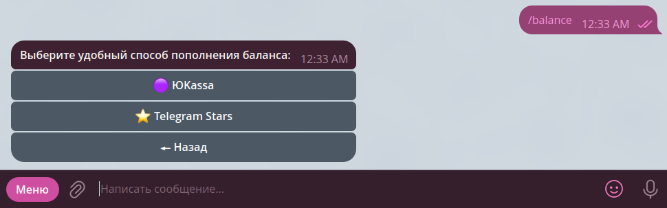
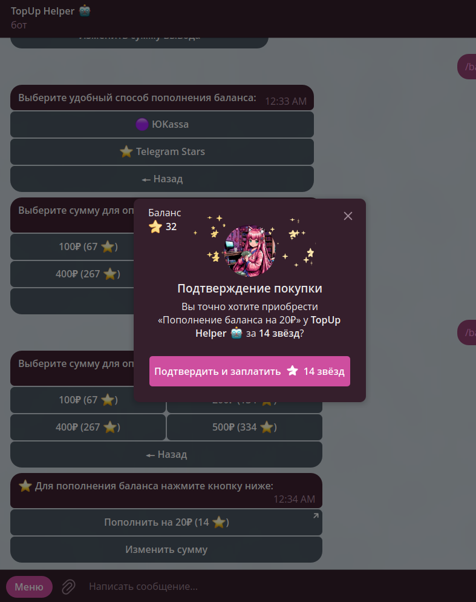
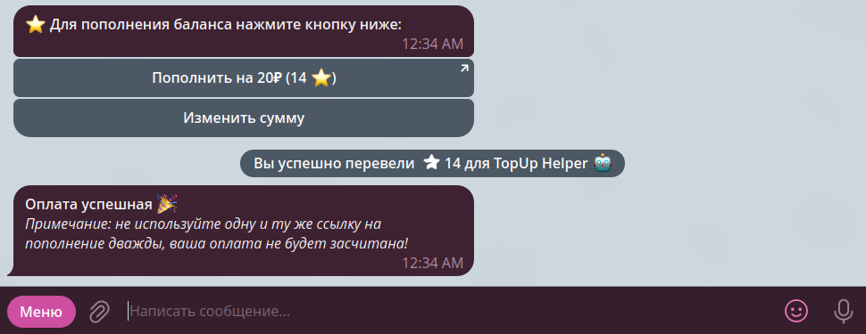

&nbsp;

## 🌐 Пополнение Криптокошелька / Crypto Wallet Funding

<table>
  <tr>
    <th align="left">🇷🇺 RU</th>
  </tr>
  <tr>
    <td>
      
Каждому пользователю после регистрации присваивается уникальный EVM (Ethereum Virtual Machine) адрес. Это позволяет пользователям использовать бота практически для любого сайта, баланс на котором можно пополнять криптой, либо для вывода средств на иные кошельки.

      
Имея баланс на аккаунте бота, пользователи могут пополнить свой криптокошелек. Достаточно указать лишь сумму пополнения в рублях. 
      Помимо этого, после каждой успешной ончейн транзакции пользователь получает ее хэш и ссылку на транзакцию в обозревателе.

      
Пополнить кошелек можно в одной из следующих сетей:

      <ul>
        <li><b>Base</b></li>
        <li><b>Polygon</b></li>
        <li><b>Optimism</b></li>
        <li><b>Arbitrum</b></li>
      </ul>
      
Курс рассчитывается через api Binance, а пополнение происходит обычным ончейн переводом со специального кошелька, который выступает хранилищем средств исключительно для бота.

    </td>
  </tr>
  <tr>
    <th align="left">🇺🇸 EN</th>
  </tr>
  <tr>
    <td>
      
Once signed up, each user is assigned a unique EVM (Ethereum Virtual Machine) address after registration. This allows users to use the bot for almost any website where the balance can be funded with crypto, or to withdraw funds to other wallets.

      
Having a balance on the bot account, users can fund their crypto wallet. It is enough to specify only the amount of funding in rubles. 
      In addition, after each successful onchain transaction, the user receives its hash and a link to the transaction in the blockchain explorer.

      
You can fund your wallet in one of the following networks:

      <ul>
        <li><b>Base</b></li>
        <li><b>Polygon</b></li>
        <li><b>Optimism</b></li>
        <li><b>Arbitrum</b></li>
      </ul>
      
The exchange rate is calculated via Binance's api, and funding is done by a simple onchain transfer from a special wallet, which acts as a depository of funds exclusively for the bot.

    </td>
  </tr>
</table>

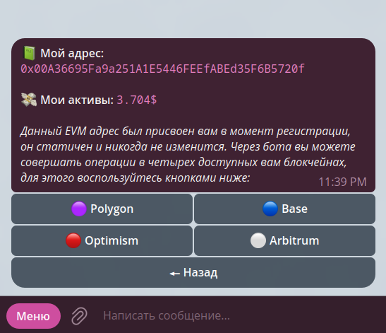
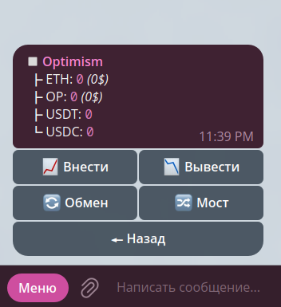
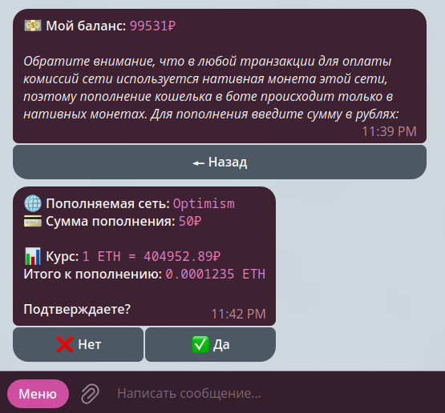
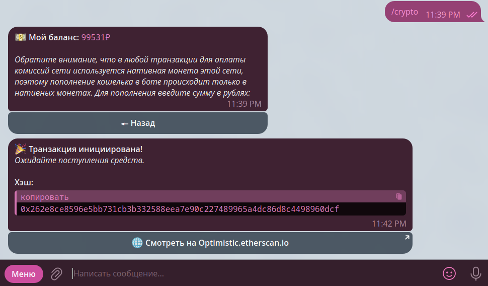
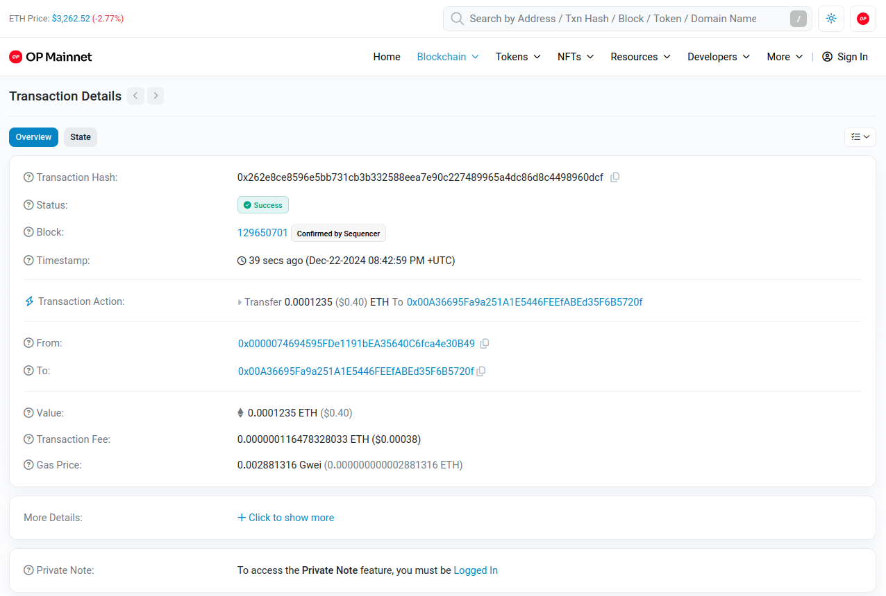

&nbsp;

## 💸 Вывод Средств / Withdrawals

<table>
  <tr>
    <th align="left">🇷🇺 RU</th>
  </tr>
  <tr>
    <td>
      Пользователи могут вывести средства на чужой криптокошелек, зная адрес получателя. Нужно выбрать желаемую сеть перевода, монету в этой сети и указать сумму перевода, при подтверждении инициации транзакции будет показана стоимость газа сети в GWei, а также рассчитана комиссия для перевода.
    </td>
  </tr>
  <tr>
    <th align="left">🇺🇸 EN</th>
  </tr>
  <tr>
    <td>
      Users can withdraw funds to someone else's cryptocurrency wallet by knowing the recipient's address. You need to select the transfer chain, the coin in this chain and specify the amount to transfer, when confirming the initiation of the transaction will be shown the cost of network gas in GWei, as well as calculated commission for the transfer.
    </td>
  </tr>
</table>

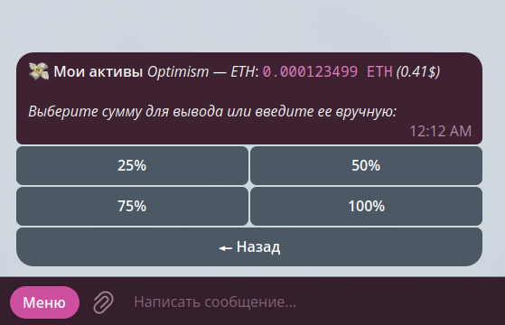
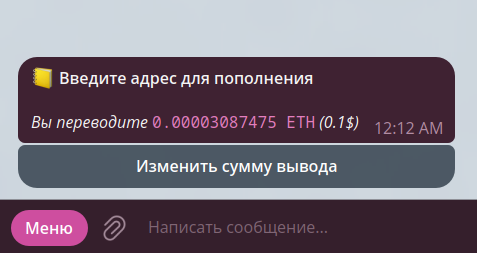
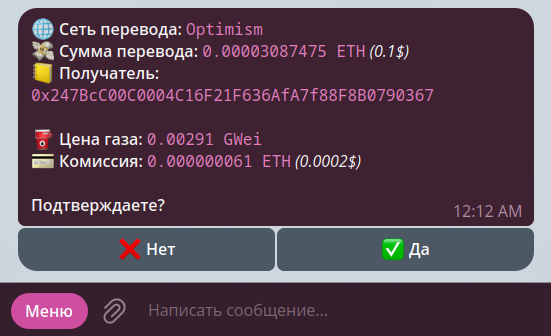
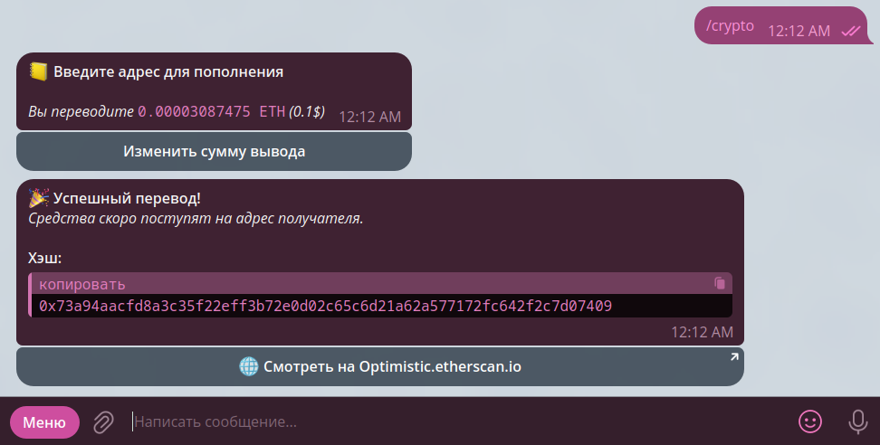
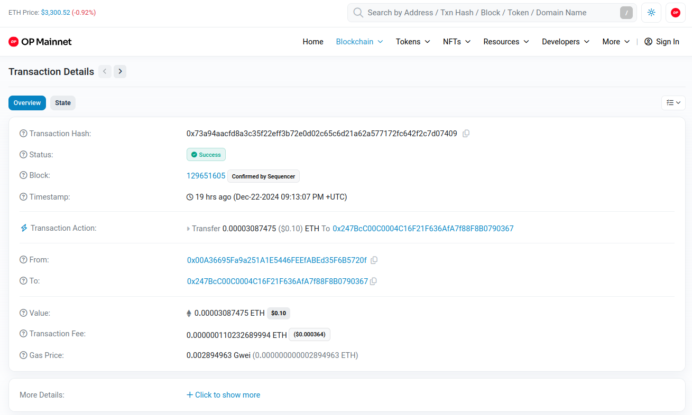

&nbsp;

## 🔄 Свапы / Swaps

<table>
  <tr>
    <th align="left">🇷🇺 RU</th>
  </tr>
  <tr>
    <td>
      
Помимо вывода средств, пользователи могут сделать свап прямо внутри бота, опять же, в рамках четырех представленных сетей. Для этого пользователь выбирает монету, которую он хотел бы продать, а затем из оставшихся монет ту, которую хотел бы приобрести. После указания параметров транзакции нужно будет ее подтвердить, сверив все указанные данные.

      <blockquote>
        Для проведения свапов используется Classic swaps API от 1inch:
      </blockquote>
      <code>https://portal.1inch.dev/documentation/apis/swap/classic-swap/introduction</code>
    </td>
  </tr>
  <tr>
    <th align="left">🇺🇸 EN</th>
  </tr>
  <tr>
    <td>
      
In addition to withdrawals, users can do a swap right in the bot, again, within the four networks presented. To do this, the user selects the coin they would like to sell and then, from the remaining coins, the one they would like to purchase. After specifying the parameters of the transaction, you need to confirm it by verifying all the specified data.

      <blockquote>
        For swaps my bot uses the Classic swaps API from 1inch:
      </blockquote>
      <code>https://portal.1inch.dev/documentation/apis/swap/classic-swap/introduction</code>
    </td>
  </tr>
</table>

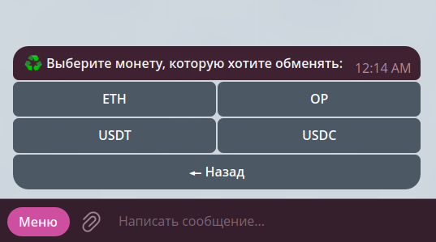
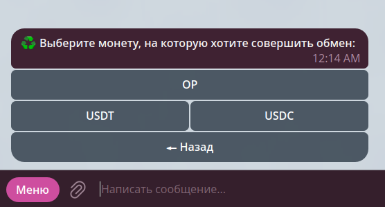
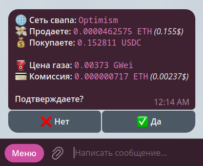
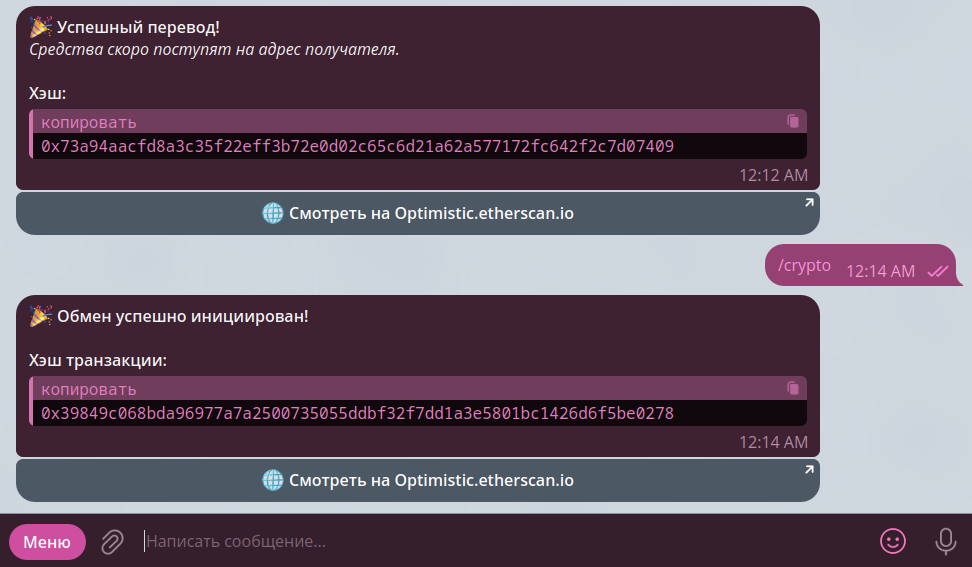
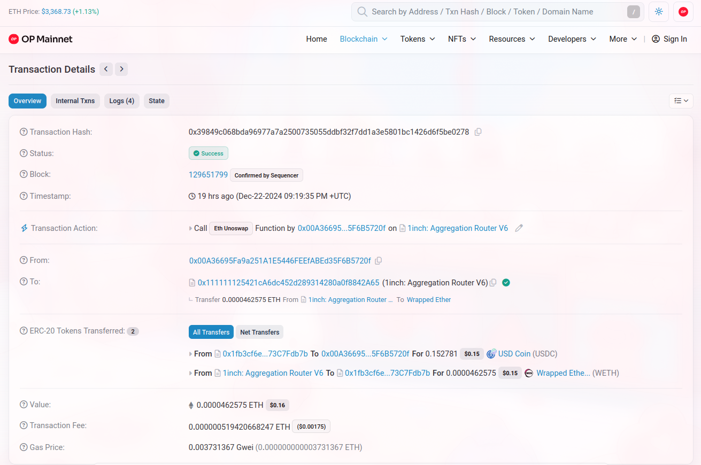

<table>
  <tr>
    <th align="left">🇷🇺 RU</th>
  </tr>
  <tr>
    <td>
      Если пользователь хочет продать ERC20 токен, в таком случае бот сначала запросит approve-транзакцию на использование протоколом выбранной суммы, если размер allowance меньше выбранной суммы. После инициации транзакции будет также отправлен хэш транзакции и ссылка на обозреватель, затем пользователь может перейти к свапу, который происходит по стандартной процедуре.
    </td>
  </tr>
  <tr>
    <th align="left">🇺🇸 EN</th>
  </tr>
  <tr>
    <td>
      If the user wants to sell an ERC20 token, in this case the bot will first request an approve transaction for the protocol to use the selected amount if the allowance is less than the selected amount. After the transaction is initiated, a hash of the transaction and a link to the blockchain explorer will also be sent, then the user can proceed to the swap, which happens according to the standard procedure.
    </td>
  </tr>
</table>

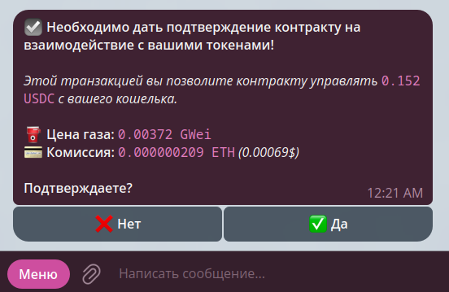
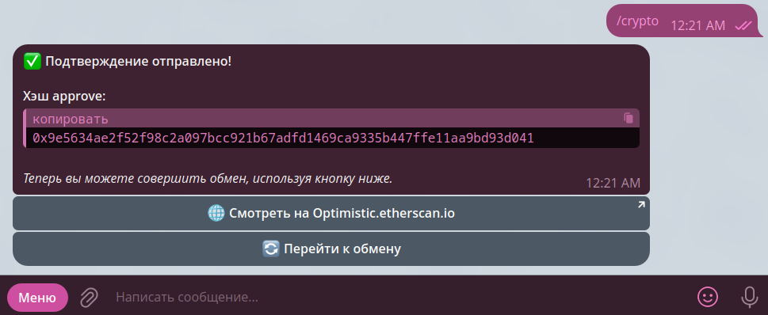

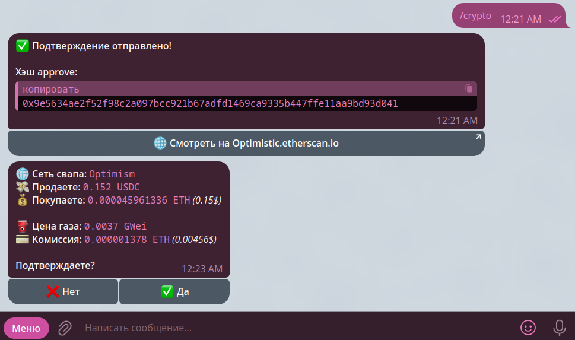
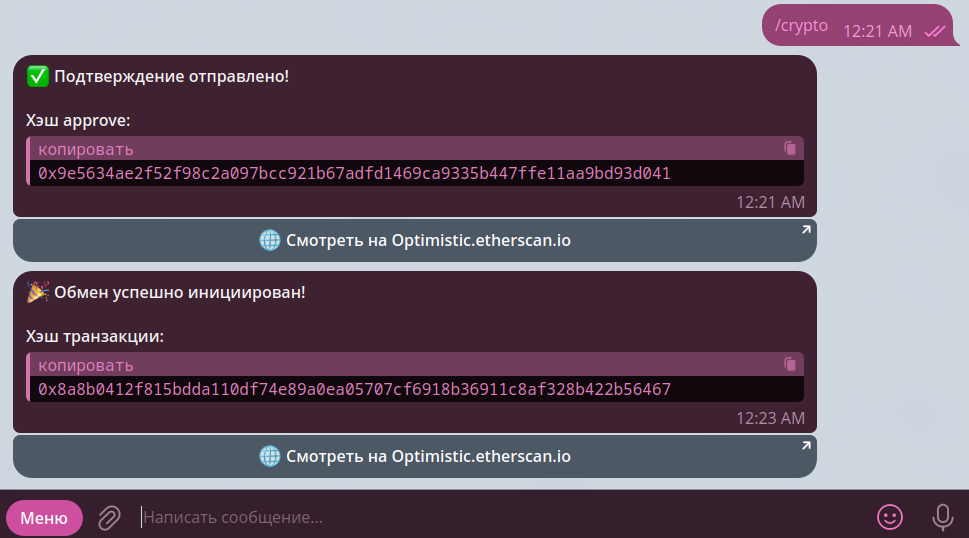
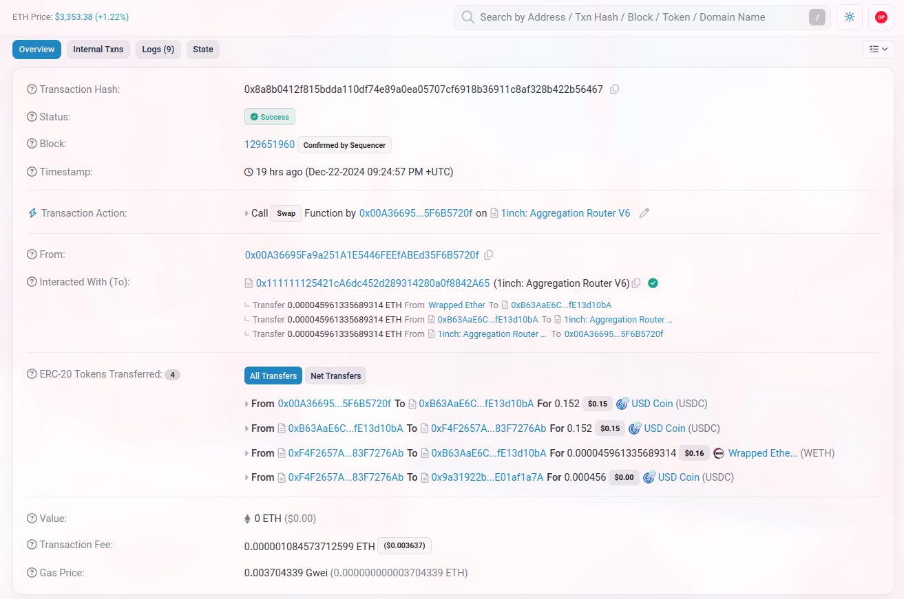

&nbsp;

&nbsp;

    <h1>Другие особенности / Other features</h1>

## 💰 Переводы Баланса / Balance Transfers

<table>
  <tr>
    <th align="left">🇷🇺 RU</th>
  </tr>
  <tr>
    <td>
      Пользователи могут отправить свой баланс любому другому пользователю, зная его ID, при условии, что получатель подтвердил свой номер телефона в боте. Можно так же добавить любое текстовое сообщение при переводе, либо пропустить этот шаг.
    </td>
  </tr>
  <tr>
    <th align="left">🇺🇸 EN</th>
  </tr>
  <tr>
    <td>
      Users can send their balance to any other user by knowing their ID, as long as the recipient has confirmed their phone number in the bot. You can also add any text message when transferring, or skip this step.
    </td>
  </tr>
</table>

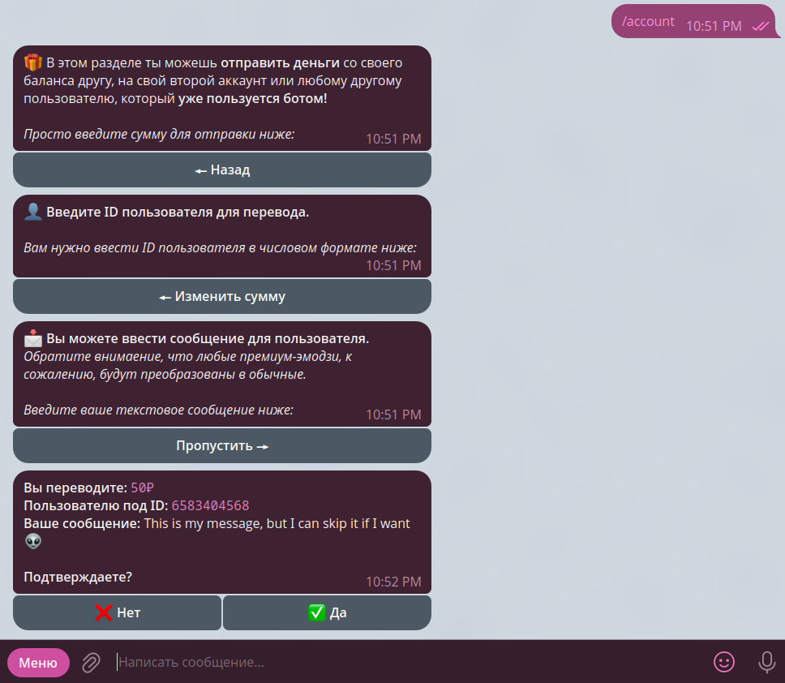
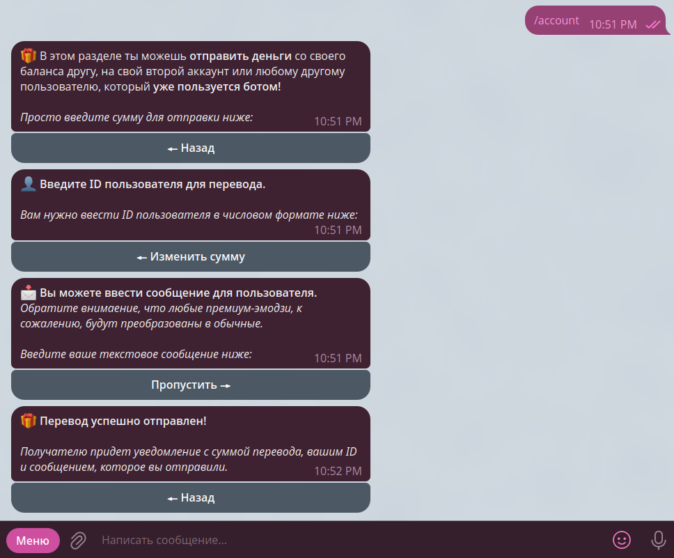

<table>
  <tr>
    <th align="left">🇷🇺 RU</th>
  </tr>
  <tr>
    <td>
      После отправки перевода, получатель в чате с ботом получит уведомление о переводе. Оно содержит ID отправителя, сумму перевода и сообщение, если оно было.
    </td>
  </tr>
  <tr>
    <th align="left">🇺🇸 EN</th>
  </tr>
  <tr>
    <td>
      After sending, the recipient will receive a notification about the transfer in chat with the bot. It contains the sender's ID, the amount of the transfer, and the message, if this step was not skipped.
    </td>
  </tr>
</table>

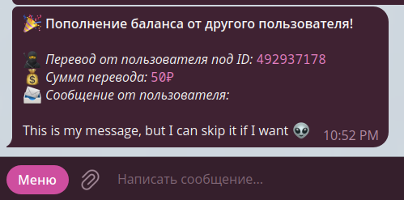

&nbsp;

## 📜 Журнал Транзакций / Transaction Log

<table>
  <tr>
    <th align="left">🇷🇺 RU</th>
  </tr>
  <tr>
    <td>
      
Любая операция, будь то пополнение рублями, переводы между пользователями, пополнения/выводы с криптокошелька или свапы, записываются в <b>журнал транзакций</b>, который можно найти в личном кабинете бота.

      
Журнал содержит:

      <ul>
        <li>Дату и время каждой транзакции</li>
        <li>Сумму транзакции (в рублях или долларах, если это ончейн перевод)</li>
        <li>
          Подробные детали транзакции:
          <ul>
            <li>ID получателя/отправителя, если это перевод между пользователями</li>
            <li>Сеть вывода/пополнения</li>
            <li>Монеты вывода/пополнения/свапа</li>
            <li>Ссылка на транзакцию в блокчейн обозревателе</li>
          </ul>
        </li>
        <li>Уникальный номер транзакции, который бот генерирует для удобства ее поиска в базе</li>
      </ul>
    </td>
  </tr>
  <tr>
    <th align="left">🇺🇸 EN</th>
  </tr>
  <tr>
    <td>
      
Any transaction, be it funding with rubles, transfers between users, deposits/withdrawals from a cryptocurrency wallet or swaps, are recorded in the <b>transaction log</b>, which can be found in the bot's personal cabinet.

      
The log contains:

      <ul>
        <li>Date and time of every transaction</li>
        <li>Transaction amount (in rubles or dollars if it is an onchain transfer)</li>
        <li>
          Detailed transaction parameters:
          <ul>
            <li>Recipient/sender ID if it is a user-to-user transfer</li>
            <li>Withdrawal/funding chain</li>
            <li>Coins of withdrawal/fund/swap</li>
            <li>Link to the transaction in the blockchain explorer</li>
          </ul>
        </li>
        <li>A unique transaction number that the bot generates for easy search of the transaction in the database</li>
      </ul>
    </td>
  </tr>
</table>

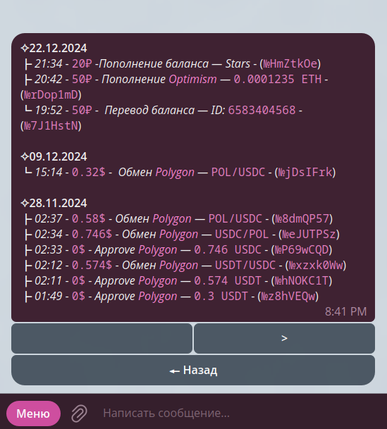
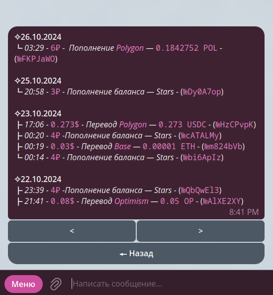

&nbsp;

## 🆘 Чат Поддержки / Support Chat

<table>
  <tr>
    <th align="left">🇷🇺 RU</th>
  </tr>
  <tr>
    <td>
      
При возникновении вопросов, пользователь может обратиться в чат поддержки бота. При создании обращения генерируется уникальный номер обращения, в рамках которого происходит коммуникация пользователя с администрацией бота: отправленное сообщение пользователя приходит администратору в чате с ботом, а ответ администрации будет отправлен в чат пользователя, который задавал вопрос.

      
При ответе на сообщение, диалог продолжается в рамках указанного номера обращения для удобства отслеживания полного диалога по определенной тематике. Для нового вопроса на смежную тему рекомендуется создавать новое обращение. Помимо этого, на одно и то же сообщение можно ответить несколько раз, если есть такая необходимость, не дожидаясь ответа собеседника.

      <blockquote>
        Для более подробного описания проблемы пользователь может прикрепить любой документ: фото, видео, файл и тд, однако вложение обязательно должно быть <strong>документом</strong>, в ином случае, например, если отправляется фотография со сжатием, получателю будет доставлен только текст сообщения, без вложения.
      </blockquote>
    </td>
  </tr>
  <tr>
    <th align="left">🇺🇸 EN</th>
  </tr>
  <tr>
    <td>
      
If a user has any questions, he/she can contact the bot support chat. When creating a request, a unique request number is generated, within which the user communicates with the bot administration: the user's sent message goes to the administrator in the chat with the bot, and the administration's reply will be sent to the chat of the user who asked the question.

      
When answering the message, the dialog continues within the specified request number for the convenience of tracking the full dialog on a certain topic. For a new question on a related topic, it is recommended to create a new message. In addition, the same message can be replied several times, if necessary, without waiting for reply.

      <blockquote>
        For a more detailed description of the problem the user can attach any document: photo, video, file, etc. However, the attachment must be a <strong>document</strong>, otherwise, for example, if a compressed photo is sent, only the text of the message will be delivered to the recipient, without the attachment.
      </blockquote>
    </td>
  </tr>
</table>

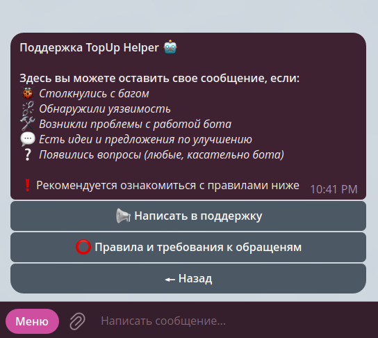
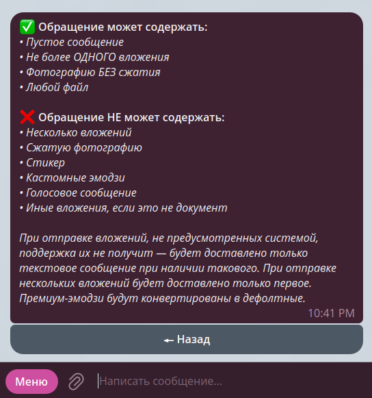
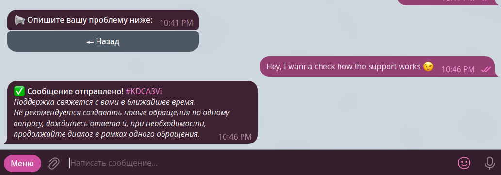
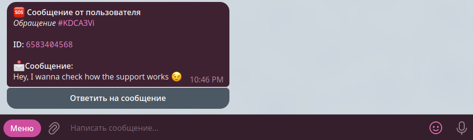

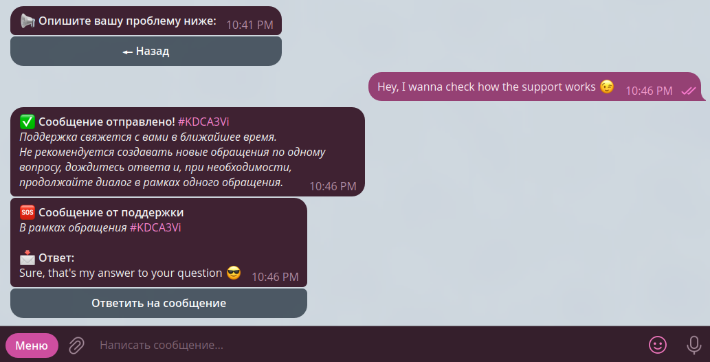
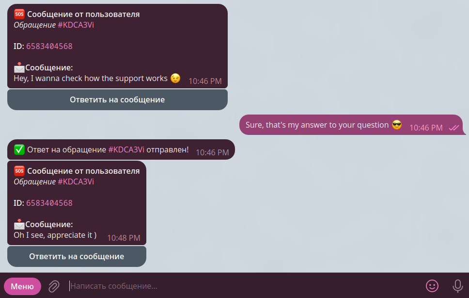

&nbsp;

## ❌ Обработка Ошибок / Error Handling

<table>
  <tr>
    <th align="left">🇷🇺 RU</th>
  </tr>
  <tr>
    <td>
      
Очевидно, каждый сценарий взаимодействия с пользователем обрабатывается. Например:

      <ul>
        <li>Пользователь может указать нечисловое значение при вводе суммы.</li>
        <li>Ввести неверный ID пользователя или адрес кошелька при переводе.</li>
        <li>У него может не хватать средств на комиссию при ончейн транзакции.</li>
        <li>Намеренно выбрать отрицательное значение при указании суммы.</li>
      </ul>
      
Любое неверное действие пользователя или ошибка на стороне бота/блокчейна обрабатываются предупреждающим сообщением и предлагают соответствующие решения для конкретного случая.

    </td>
  </tr>
  <tr>
    <th align="left">🇺🇸 EN</th>
  </tr>
  <tr>
    <td>
      
Obviously, every user interaction scenario is handled. For example:

      <ul>
        <li>A user may specify a non-numeric value when entering an amount.</li>
        <li>Incorrectly enter a user ID or wallet address when making a transfer.</li>
        <li>Not have enough funds for the commission on an onchain transaction.</li>
        <li>Deliberately choose a negative value when specifying the amount.</li>
      </ul>
      
Any incorrect user action or error on the bot/blockchain side is handled with a warning message and offers appropriate solutions for the specific case.

    </td>
  </tr>
</table>

&nbsp;

## 🔮 Какие планы на будущее ? / What are the future plans ?

<table>
  <tr>
    <th align="left">🇷🇺 RU</th>
  </tr>
  <tr>
    <td>
      
В целом бот уже полностью функционирует, но также можно добавить:

      <ul>
        <li>Кросс-чейн переводы внутри бота между разными сетями</li>
        <li>Переводы баланса по номеру телефона</li>
        <li>Реферальную систему (под вопросом, но идея интересная)</li>
      </ul>
      
И еще что-нибудь интересное, если будут новые идеи ☺️

    </td>
  </tr>
  <tr>
    <th align="left">🇺🇸 EN</th>
  </tr>
  <tr>
    <td>
      
Overall the bot is already fully functional, but can also be added:

      <ul>
        <li>Cross-chain swaps within the bot between different networks</li>
        <li>Balance transfers by phone number</li>
        <li>Referral system (questionable, but the idea is interesting)</li>
      </ul>
      
And something else interesting if you have new ideas ☺️

    </td>
  </tr>
</table>

